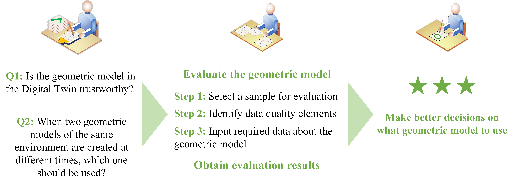

# gdt_framework

### A Framework for Assessing and Updating Photogrammetry-Based Geometric Digital Twins  

Keeping a Geometric Digital Twin up to date is challenging due to changes in the built environment, data acquisition limitations, and the lack of clear evaluation methods. This framework provides a structured approach to assessing geometric model quality, focusing on data quality elements, change detection, and resolution validation.  

Download the Excel files to apply the framework to your model: [Empty template](gdt_fr_template.xlsx), [Example file](gdt_fr_paper.xlsx)

The framework is implemented as the [Geometric Digital Twin Assessment Tool](https://gdttool-01.streamlit.app/)

For more details, reach out to us or see: [Link will be here].

